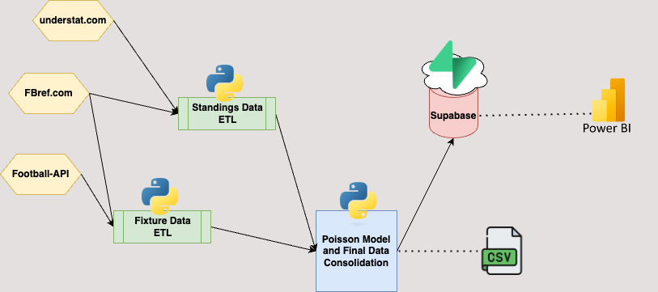

# FootballPredictor-V2.0

## A functional program that scrapes data from multiple sources (FBRef.com, understat, etc.) to predict football game outputs

As funny as it sounds, this project was initiated in 2022 seeking to get some money out of spending several hours per week watching my favorite team FC Barcelona suffering through our darkest era. I came across a book named "The xG philosophy" that introduced the concepts of expected goals and expected value in football to assess performance of a team or a player based on their goal scoring opportunities.

Unlike traditional stats (i.e. goals) that focus on quantity, xG focuses on quality of the opportunities created, which left me thinking in ways to leverage it into an actual money making strategy. That's why I created this project, when my python knowledge was somewhat limited, and I owe a lot of my coding progress to this project, which by the way generated some profits.

### Full-End Data Project

* Scrapes Standings Data and applies data transformations to get xG values per game for each home and visitor performance, from the following sources:
- Understat.com -> Covers top 5 Main European Leagues (La Liga, Premier, Bundesliga, Ligue1, Serie A)
- FBRef.com -> Covers more than 40 other leagues world-wide including some women's league. Note that not all leagues from this source have xG data.

* Scrapes Fixtures data for determining what games are scheduled next and detect them automatically (it is done by leveraging api-football REST API and scraping directly from FBRef.com)

* The data then goes through a pipeline that leverages scipy library to make predictions based on Poisson Distribution:
- Over/Under -> outputs the likelihood of a game having more than 1.5, 2.5 or 3.5 goals .
- H2H -> Outputs the likelihood of the outcome of the game (Home wins, Draw, Away Wins)

* The output dataset with predictions is then consolidated and exported into a cloud database (Supabase) for running analytics on performance. A Power BI dashboard will connect to the cloud database for reporting purposes as well -- Still in Development

The overall objective of this project is to leverage xG and xGA metrics for developing a decision support system for smart gamblers, and potentially make some extra profits.

### Diagram

### Potential Improvements
These program leverages traditional statistical tools, and only focuses on one metric (xG). By leveraging machine learning models and through the extraction of more granular and diverse data for each team, we may be able to come up with a more effective system. This is currently in development.

We could integrate the code with some APIs from the actual betting sites trying to optimize money by having likelihood output from the model vs the expected value of the odd from betting sites. Implementing Kelly Criterion here would be more seamless as well.